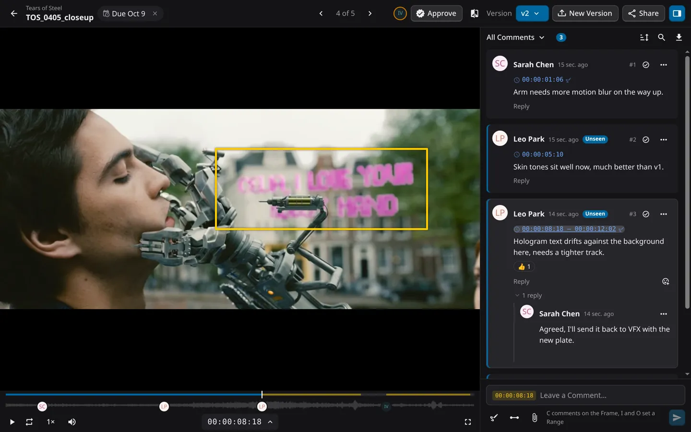
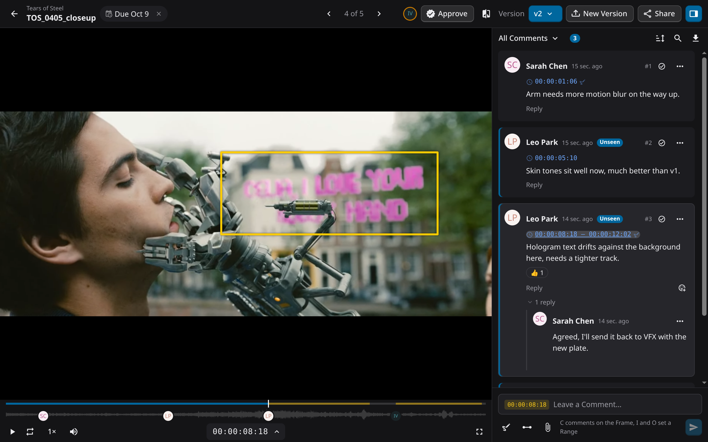
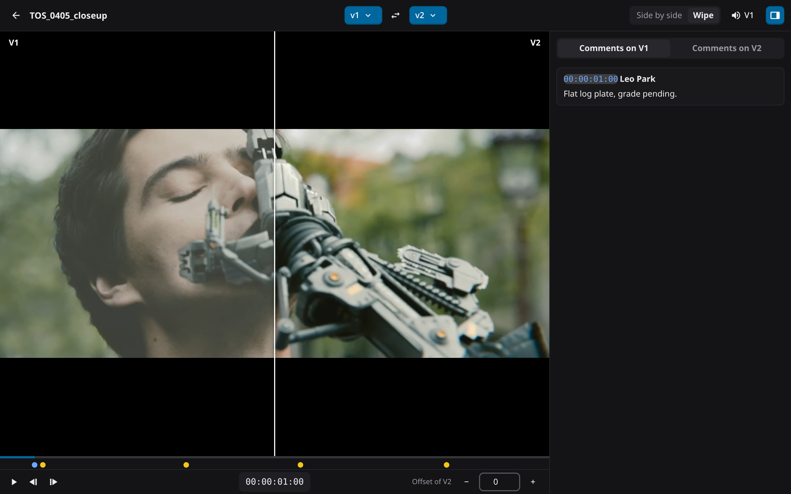
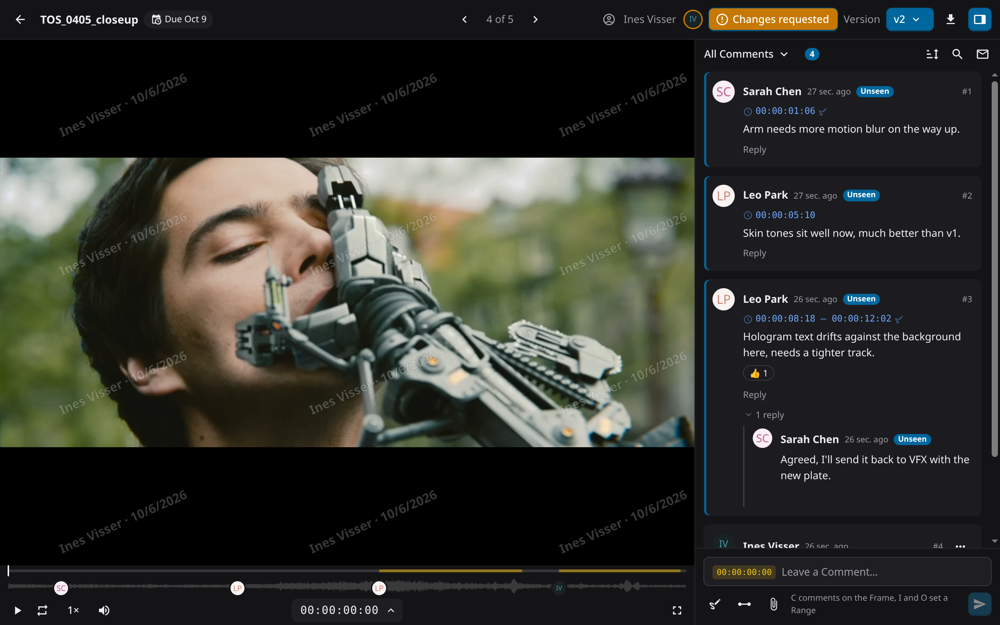
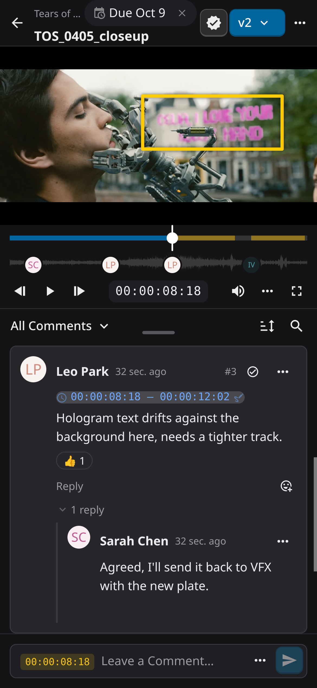
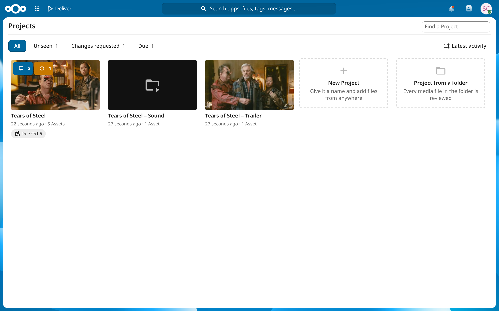
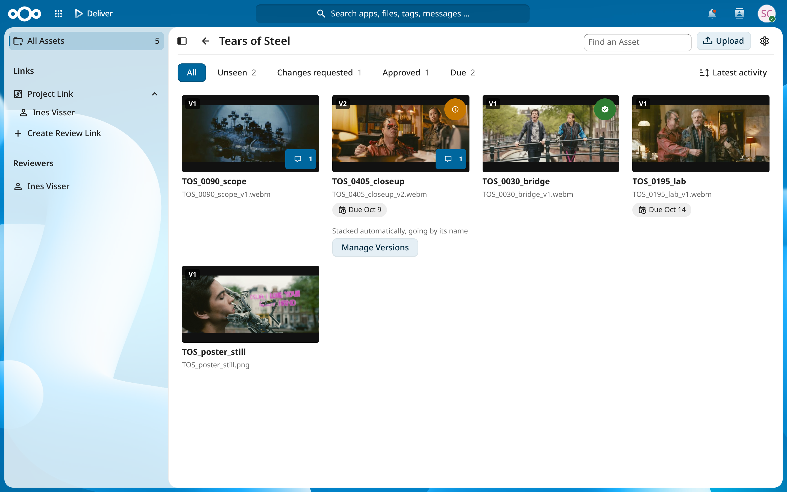

# Deliver

**Frame-accurate video and audio review, right where your files already are.**

> **Pre-release.** The 0.x releases come before 1.0: use Deliver on real projects, but keep your own backups and expect rough edges. 1.0 follows once they have settled.

## What it does

- **Review in place** from the Files sidebar, or a whole folder as a Project. Nothing is copied or moved.
- **Comments on the Frame** or a Range, with Drawings, Replies, Reactions, Mentions and Attachments
- **Versions** stack by name (`…_v1`, `…_v2`) and compare side by side or under a wipe
- **Sign-off** with Approvals, Due Dates and reminders
- **Clients without accounts** on Project Links: password, expiry, Watermark, downloads, and who watched what
- **Back into the edit** export comments as markers for:
  - Video: DaVinci Resolve (EDL), Premiere Pro (FCP7 XML), Final Cut Pro (FCPXML), CSV
  - Audio: WAV markers, MIDI, REAPER regions, Ableton Live Set
- **Supported files**
  - Video: MP4 and MOV (H.264), WebM
  - Audio: WAV, FLAC, MP3, AAC, Ogg
  - Images: JPEG, PNG, WebP, GIF, AVIF
  - Everything else (ProRes, H.265, MXF, AVI …) needs ffmpeg
- **Waveforms, thumbnails and scrubbing** by hovering over a video
- **Fully mobile ready**
- **With ffmpeg on the server**
  - Proxies, thumbnails and waveforms for every format ffmpeg reads
  - Hardware encoding: VAAPI, NVENC, VideoToolbox

## Screenshots

<table>
<tr>
<td width="50%"><b>The Review view</b> </td>
<td width="50%"><b>Compare under a wipe</b> </td>
</tr>
<tr>
<td width="50%"><b>A client on a Project Link</b> </td>
<td width="50%" rowspan="3" valign="top"><b>On a phone</b> </td>
</tr>
<tr>
<td width="50%"><b>The Projects</b> </td>
</tr>
<tr>
<td width="50%"><b>A Project</b> </td>
</tr>
</table>

## Installation

Install **Deliver** from the Nextcloud App Store: *Apps → Multimedia → Deliver*. It needs Nextcloud 33 or 34 and PHP 8.2 or newer. How it fares on hosted Nextcloud is [below](#hosted-nextcloud).

Everything else is optional:

- **ffmpeg and ffprobe** on the server, for Proxies, Thumbnail Strips and hardware encoding (*With ffmpeg on the server* above). Shared hosting without them works for browser-native files.
- **The Movie preview provider**, so that lists show a still of each video instead of an icon.
- **[notify_push](https://github.com/nextcloud/notify_push)**, so that new Comments reach open Review views at once instead of within seconds.

The details are in [docs/admin.md](docs/admin.md); a Compose setup for a server of your own is in [deploy/](deploy/README.md).

## Hosted Nextcloud

Deliver runs without ffmpeg and without a shell, so a managed Nextcloud can carry it, as far as its provider lets App Store apps in. What has been seen so far; additions are welcome as issues or pull requests.

| Provider | Nextcloud | Deliver in the app list | ffmpeg | Shell / `occ` | Checked |
| --- | --- | --- | --- | --- | --- |
| Hetzner Storage Share | 33.0.9 | ❌ | ❌ | ❌ | 2026-10 |
| Own server ([deploy/](deploy/README.md)) | 33, 34 | ✅ | ✅ | ✅ | 2026-10 |

## Documentation

- [Running Deliver](docs/admin.md): requirements, the derived-media pipeline, hardware encoders, live updates
- [Developing Deliver](docs/development.md): the dev instance, tests, packaging and releases
- [API](docs/api.md): the OCS API and the Reviewer's surface
- [App Store](docs/app-store.md): certificate, registration and publishing
- [Glossary](CONTEXT.md), [decisions](docs/adr/) and the [spec](docs/spec-v2.md)
- [Changelog](CHANGELOG.md)

## License

AGPL-3.0-or-later. The footage in the screenshots is from *Tears of Steel*, (CC) Blender Foundation | [mango.blender.org](https://mango.blender.org), CC BY 3.0.
